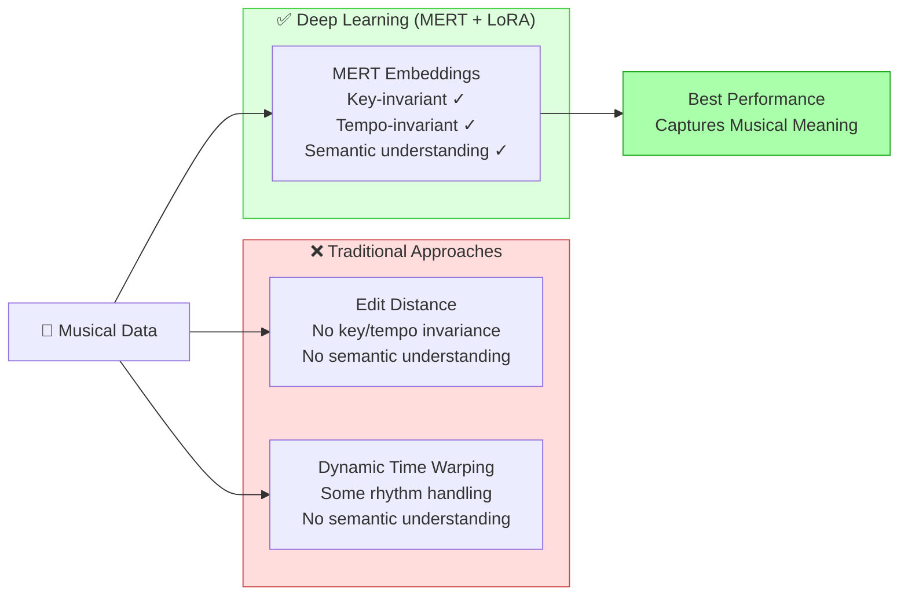
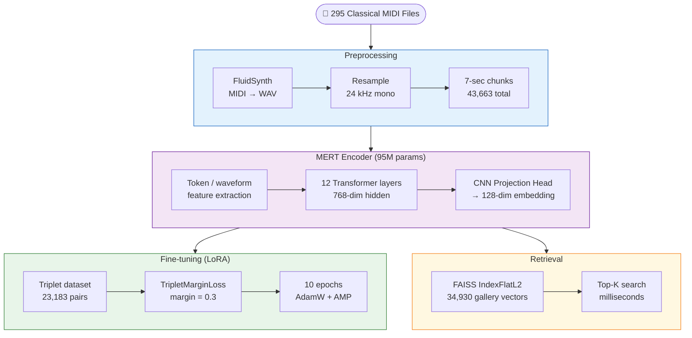
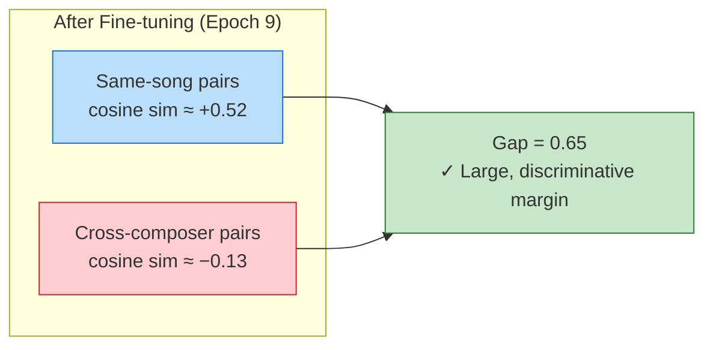
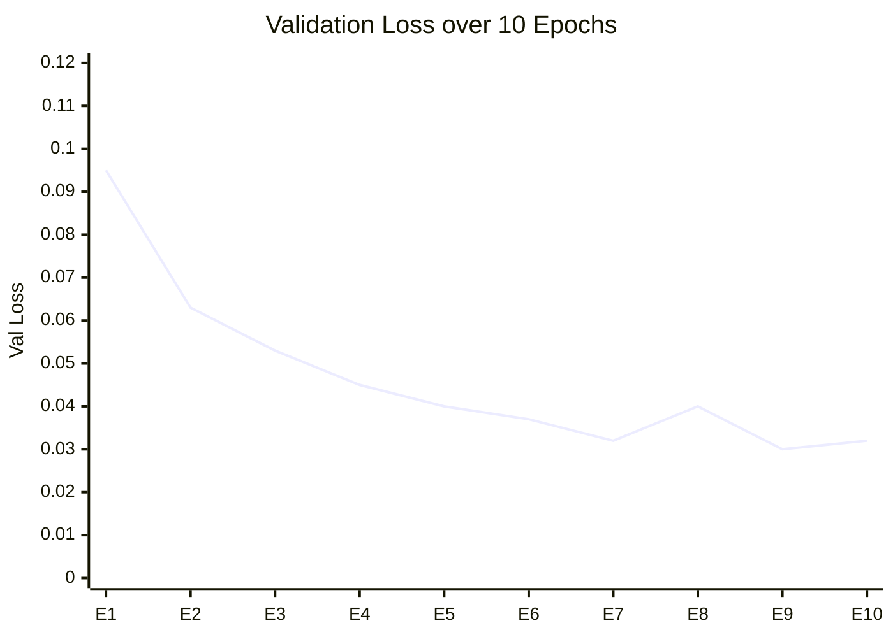
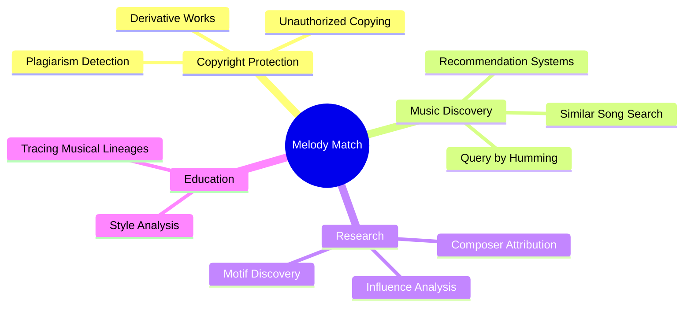
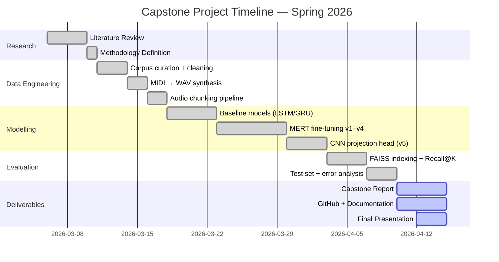

<div style={{borderRadius: '16px', overflow: 'hidden', marginBottom: '2rem', position: 'relative'}}>
  
  <div style={{position: 'absolute', inset: 0, background: 'linear-gradient(to bottom, rgba(0,0,0,0.15) 0%, rgba(0,0,0,0.65) 100%)', display: 'flex', flexDirection: 'column', justifyContent: 'flex-end', padding: '2rem'}}>
    <h1 style={{color: '#fff', margin: 0, fontSize: '2rem', fontWeight: 800}}>Melody Match — Music Similarity with MERT</h1>
    <p style={{color: 'rgba(255,255,255,0.85)', margin: '0.5rem 0 0', fontSize: '1rem'}}>
      AAI-590 Applied AI Capstone · University of San Diego · Spring 2026 · Team 3
    </p>
    <p style={{color: 'rgba(255,255,255,0.7)', margin: '0.25rem 0 0', fontSize: '0.9rem'}}>
      Manikandan Perumal · Darin Verduzco · Israel Romero
    </p>
  </div>
</div>

---

## What Is This Project?

**Melody Match** is a deep-learning system that identifies whether two pieces of classical music are similar — even across different tempos, keys, and recordings. Given an audio query, the system retrieves the most similar pieces from a 295-song classical catalogue using semantic embeddings, not rule-based matching.

The core idea is to fine-tune **MERT** (Music Encoder Representations from Transformers), a 95M-parameter audio foundation model, to produce embeddings that cluster music by composer and melody, then index those embeddings with **FAISS** for fast nearest-neighbour retrieval.

---

## Presentation Video

<div style={{position: 'relative', paddingBottom: '56.25%', height: 0, overflow: 'hidden', borderRadius: '12px', marginBottom: '2rem', boxShadow: '0 4px 24px rgba(0,0,0,0.15)'}}>
  <iframe
    src="https://www.youtube.com/embed/D2opYEuRxb4"
    title="Melody Match Demo"
    allow="accelerometer; autoplay; clipboard-write; encrypted-media; gyroscope; picture-in-picture"
    allowFullScreen
    style={{position: 'absolute', top: 0, left: 0, width: '100%', height: '100%', border: 'none'}}
  />
</div>

---

## Motivation

Traditional music similarity methods fail to capture **musical meaning**:



---

## System Overview



---

## Key Results

| Model | Recall@1 | Recall@3 | Recall@5 | Recall@10 |
|-------|:--------:|:--------:|:--------:|:---------:|
| **MERT + LoRA + CNN (v5)** | **63.6%** | **73.6%** | **77.9%** | **83.3%** |
| Baseline MERT (no fine-tuning) | 45.5% | 55.6% | 60.7% | 67.9% |
| Improvement | +18.1 pp | +18.1 pp | +17.2 pp | +15.4 pp |

```mermaid
xychart-beta
    title "Recall@K — Fine-tuned vs Baseline"
    x-axis ["R@1", "R@3", "R@5", "R@10"]
    y-axis "Recall (%)" 0 --> 100
    bar [63.6, 73.6, 77.9, 83.3]
    bar [45.5, 55.6, 60.7, 67.9]
```



---

## Embedding Separation After Fine-tuning

The model produces well-separated embedding clusters:



---

## Training Progression (v5)



---

## Applications



---

## Repository Structure

```
capstone_team_3/
├── notebooks/
│   ├── COLAB_MERT_Finetune_v5.ipynb    ← Final model (primary)
│   ├── COLAB_CNN_MEL_Similarity.ipynb
│   ├── LSTM_Model_v1.ipynb
│   ├── SiameseCNN_Model_v1.ipynb
│   ├── DataExploration.ipynb
│   ├── FeatureEngineering.ipynb
│   ├── triplet_dataset_040326.ipynb
│   ├── mert_evaluation.ipynb
│   ├── Similarity_Score_EDA.ipynb
│   ├── COLAB_Piano_Roll_test.ipynb
│   └── archive/                        ← Older iterations (v1–v4, GRU, Transformer, etc.)
├── MidiDatasets/
│   ├── 590-Classical-music-midi/       ← 295 MIDI files
│   └── TestingSamples/
├── FrontEnd/
│   ├── MidiAnalyzer.html
│   └── MidiComparator.html
└── website/                            ← This documentation
```

---

## Project Timeline


