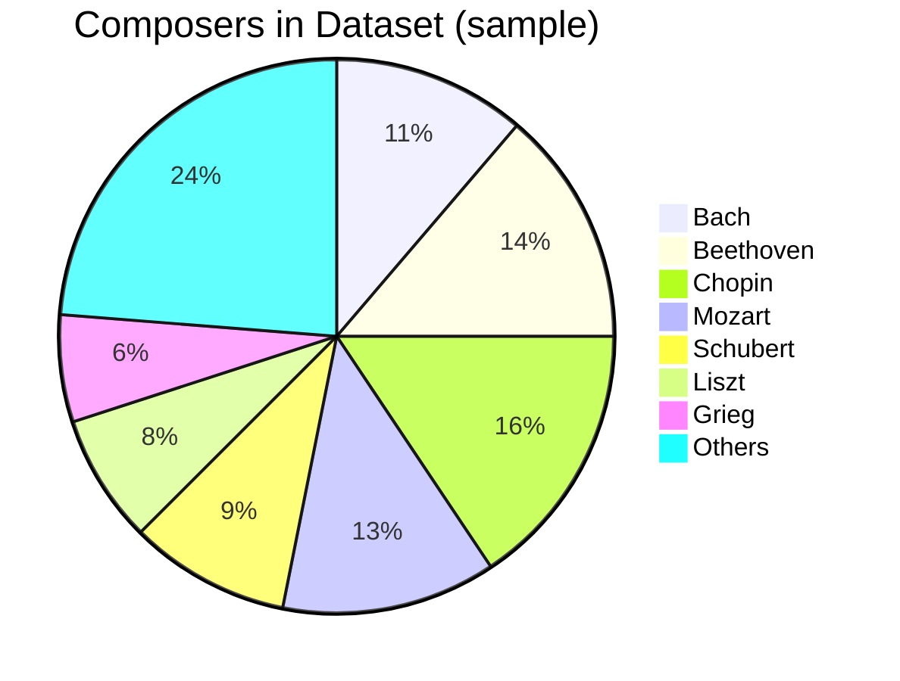
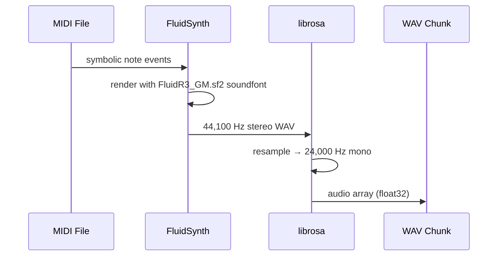
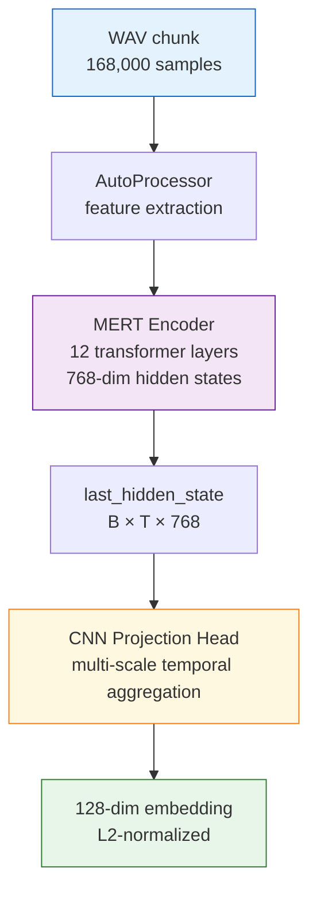
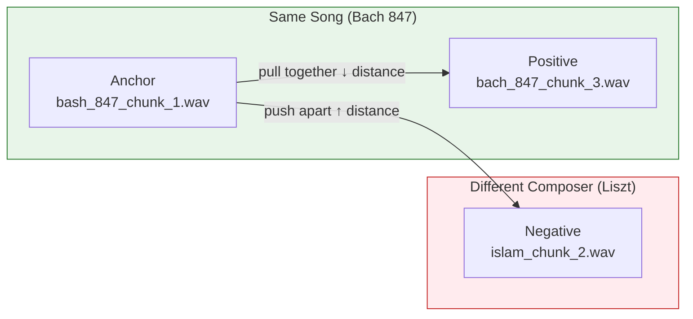
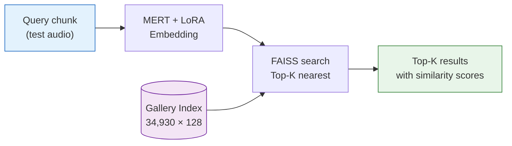

# Data Pipeline

The pipeline transforms raw MIDI files into a searchable embedding index through six stages.


---

## Stage 1 — Dataset Collection

The primary corpus is **590 classical piano MIDI files** spanning major Western composers. Files were sourced, validated, and deduplicated before processing.



**Data cleaning steps:**
- Removed corrupt or unreadable MIDI files
- Identified and deduplicated near-identical arrangements
- Validated minimum note count and duration thresholds

---

## Stage 2 — MIDI → WAV Synthesis

MIDI files are purely symbolic (note events + timing). To feed them into an audio model, each MIDI is synthesized to WAV using **FluidSynth** with the FluidR3 GM soundfont.

```bash
fluidsynth -ni FluidR3_GM.sf2 input.mid -F output.wav -r 44100
```

The resulting WAV is resampled to **24 kHz mono** using `librosa` — matching MERT's expected input sample rate.



---

## Stage 3 — Chunking

Long audio files are split into **fixed 7-second, non-overlapping chunks**. Each chunk becomes an independent retrieval unit in the index.

```python
CHUNK_LENGTH_SEC = 7
CHUNK_SAMPLES    = 24000 * 7   # 168,000 samples per chunk

for i in range(num_chunks):
    start = i * CHUNK_SAMPLES
    chunk = audio[start : start + CHUNK_SAMPLES]
    soundfile.write(f"{song}_chunk_{i+1}.wav", chunk, 24000)
```

**Dataset statistics after chunking:**

| Metric | Value |
|--------|-------|
| Total WAV chunks (gallery) | **43,663** |
| Test set chunks | 4,116 |
| Train triplets | 18,546 |
| Val triplets | 4,637 |
| Chunk duration | 7 seconds |
| Sample rate | 24 kHz |
| Total unique composers | ~30 |

---

## Stage 4 — Embedding Generation

Each 7-second chunk is passed through **MERT-v1-95M** (fine-tuned with LoRA) to produce a fixed-size vector representation.



The **CNN Projection Head** replaces naive mean-pooling with learned multi-scale temporal aggregation:

```python
class CNNProjectionHead(nn.Module):
    def __init__(self):
        self.convs = nn.ModuleList([
            nn.Conv1d(768, 256, kernel_size=k, padding=k//2)
            for k in (3, 5, 7)          # local / mid / broad patterns
        ])
        self.proj = nn.Sequential(
            nn.Linear(256 * 3, 384),
            nn.LayerNorm(384),
            nn.GELU(),
            nn.Linear(384, 128),
        )

    def forward(self, hidden_states):
        x = hidden_states.transpose(1, 2)           # (B, 768, T)
        pooled = [conv(x).mean(dim=2) for conv in self.convs]
        return F.normalize(self.proj(torch.cat(pooled, dim=1)), dim=1)
```

---

## Stage 5 — Triplet Construction for Training

The model is fine-tuned using **triplet loss**. Each training example is a triple `(anchor, positive, negative)`:



```
Loss = max(0,  d(anchor, positive) − d(anchor, negative) + 0.3)
```

Total triplets generated: **23,183** · Train: 18,546 (80%) · Val: 4,637 (20%)

---

## Stage 6 — FAISS Indexing

After embedding the full gallery, all 128-dim vectors are loaded into a **FAISS IndexFlatL2** for exact nearest-neighbour search.

```python
import faiss, numpy as np

d     = 128
index = faiss.IndexFlatL2(d)
index.add(gallery_embeddings.astype('float32'))   # 34,930 vectors

# Query: find top-10 matches for a new chunk
D, I = index.search(query_embedding, k=10)
# cosine_similarity = 1 - (L2_distance / 2)  — valid for L2-normalised embeddings
```


