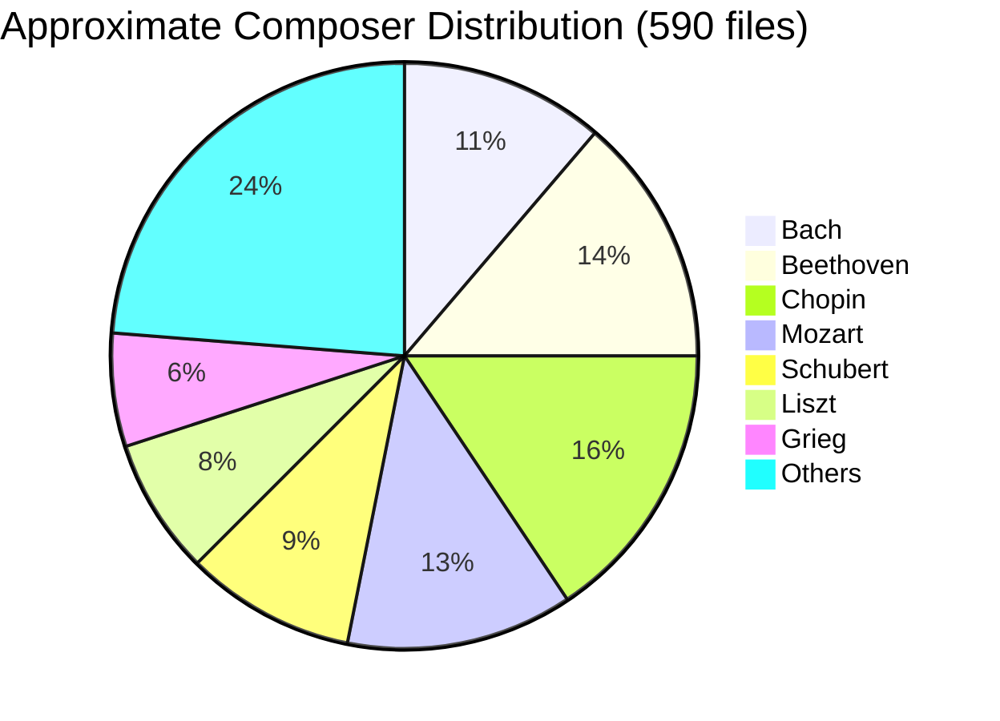
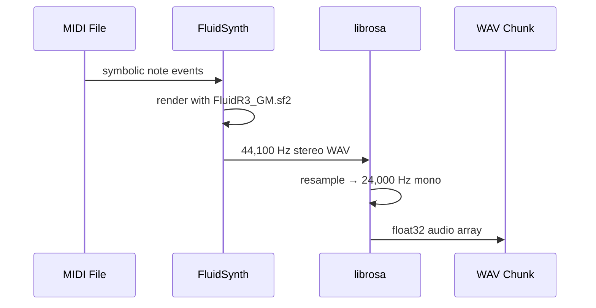
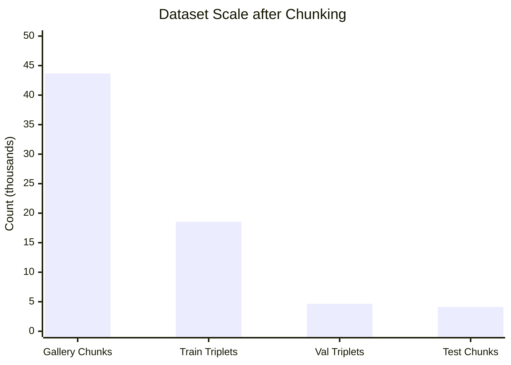
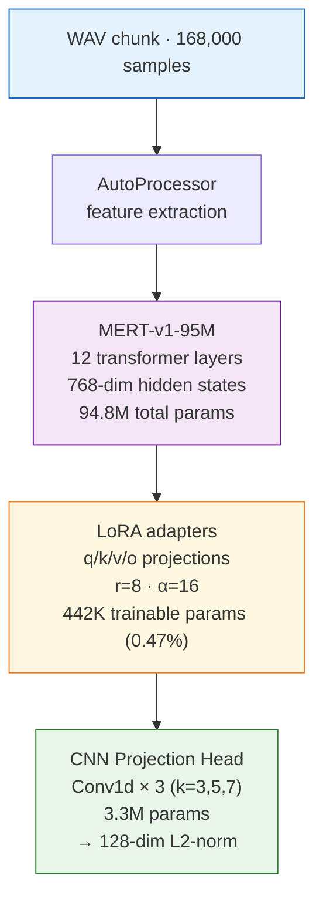
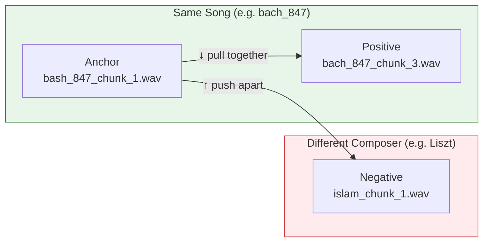
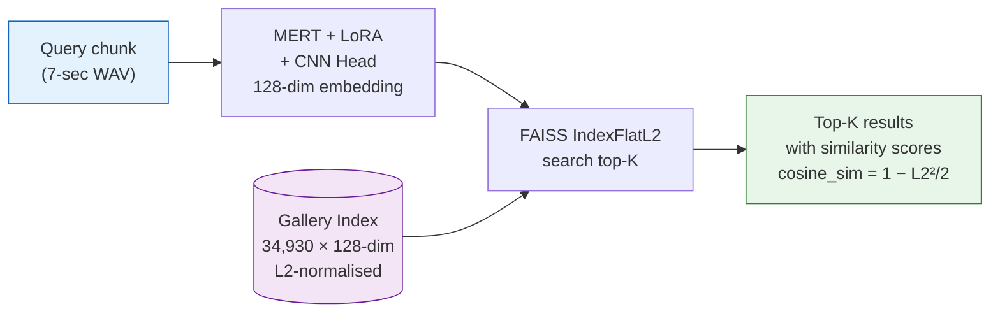

# Data Pipeline

The pipeline transforms raw MIDI files into a searchable embedding index through six stages. All statistics below are taken directly from `COLAB_MERT_Finetune_v5.ipynb` outputs.


---

## Stage 1 — Dataset Collection

590 classical piano MIDI files spanning ~30 composers.



**Data cleaning steps:**
- Removed corrupt or unreadable MIDI files
- Identified and deduplicated near-identical arrangements
- Validated minimum note count and duration thresholds

---

## Stage 2 — MIDI → WAV Synthesis

MIDI files are synthesised to WAV using **FluidSynth** with the FluidR3 GM soundfont, then resampled to **24 kHz mono** to match MERT's expected input.



```bash
fluidsynth -ni FluidR3_GM.sf2 input.mid -F output.wav -r 44100
```

---

## Stage 3 — Chunking

Each WAV is split into **fixed 7-second non-overlapping chunks** — the retrieval unit for FAISS.



**Actual notebook output:**
```
File lookup built: 43663 files
Total triplets:    23183
Train: 18546  Val: 4637   (80/20 stratified by composer)
Test chunks: 4116
```

| Metric | Value |
|--------|-------|
| Total WAV chunks (gallery) | **43,663** |
| Total triplets generated | **23,183** |
| Train split | 18,546 (80%) |
| Val split | 4,637 (20%) |
| External test chunks | 4,116 |
| Chunk duration | 7 seconds |
| Sample rate | 24,000 Hz |

---

## Stage 4 — Model Setup

**Trainable parameters from notebook output:**

```
trainable params: 442,368 || all params: 94,814,080 || trainable%: 0.4666
CNN projection head: 3,296,768 params  (filters=256, kernels=(3, 5, 7), embed=128)
Train batches: 2319  Val batches: 580
Total training steps: 23190
```



---

## Stage 5 — Triplet Training

Each training example is a `(anchor, positive, negative)` triple:



**Actual triplet sample from notebook:**

```
anchor               positive              negative              composer  song
bach_847_chunk_1.wav bach_847_chunk_2.wav  islamei_chunk_1.wav   bach      bach_847
bach_847_chunk_1.wav bach_847_chunk_3.wav  islamei_chunk_2.wav   bach      bach_847
```

Loss: `TripletMarginLoss(margin=0.3)`

---

## Stage 6 — Embedding Extraction & FAISS Index

After training, all 43,663 chunks are embedded with the best checkpoint (epoch 9):

```
Extracting all embeddings: 100%|██████████| 5458/5458 [35:09<00:00, 2.59s/it]
Saved 43663 embeddings → all_embeddings.pkl
FAISS index built. Total vectors indexed: 34930
```



**Sample FAISS search output:**
```
Query: Aragon (Fantasia) Op.47 part 6_chunk_1.wav
  Rank 1: alb_se6_chunk_41.wav   sim=0.9710  ✓ correct
  Rank 2: alb_se6_chunk_6.wav    sim=0.9618  ✓ correct
  Rank 3: alb_se6_chunk_39.wav   sim=0.9608  ✓ correct
  Rank 4: alb_se6_chunk_40.wav   sim=0.9581  ✓ correct
```
