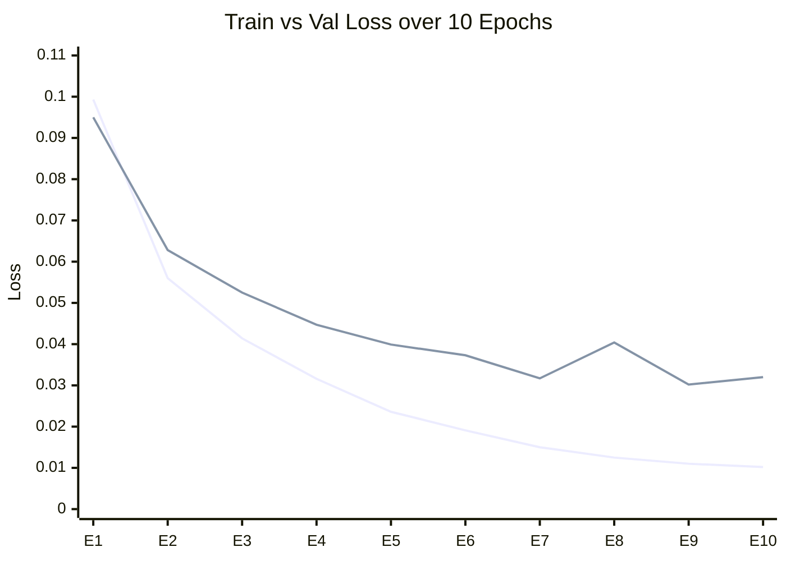
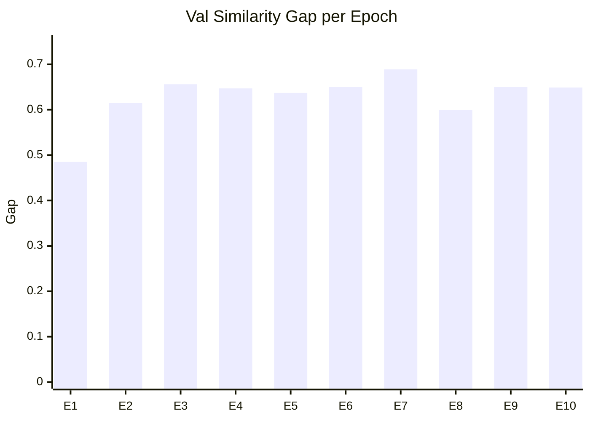
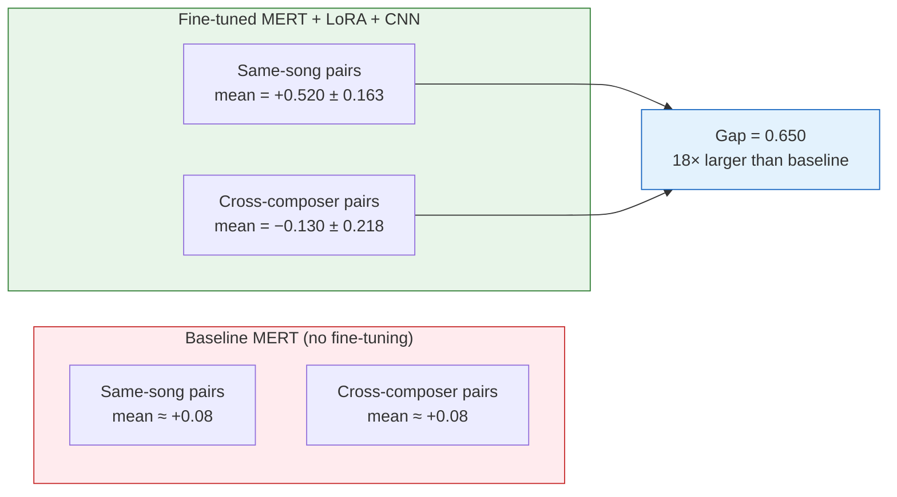
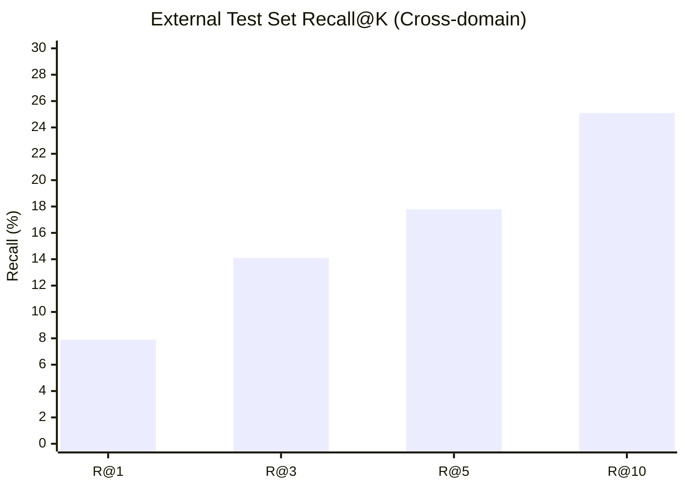
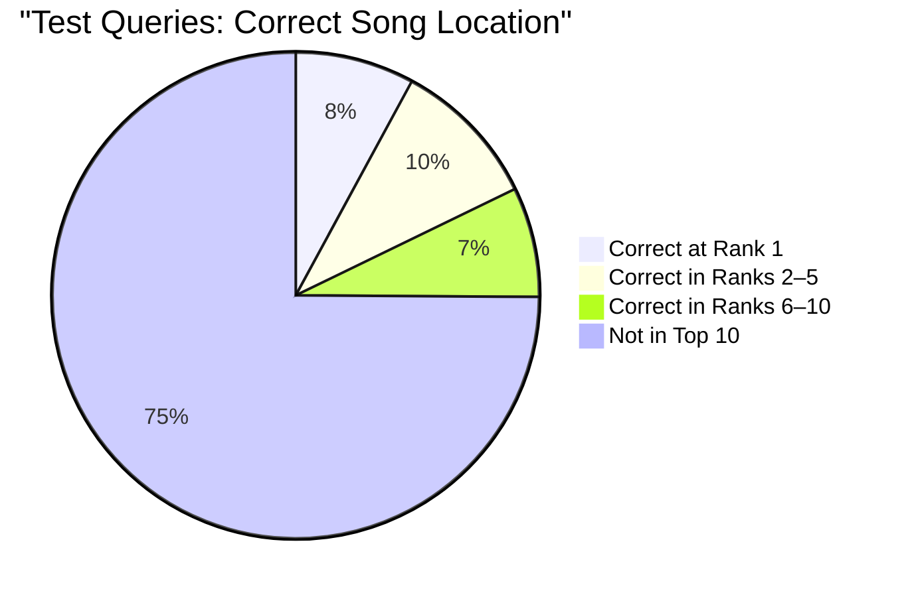
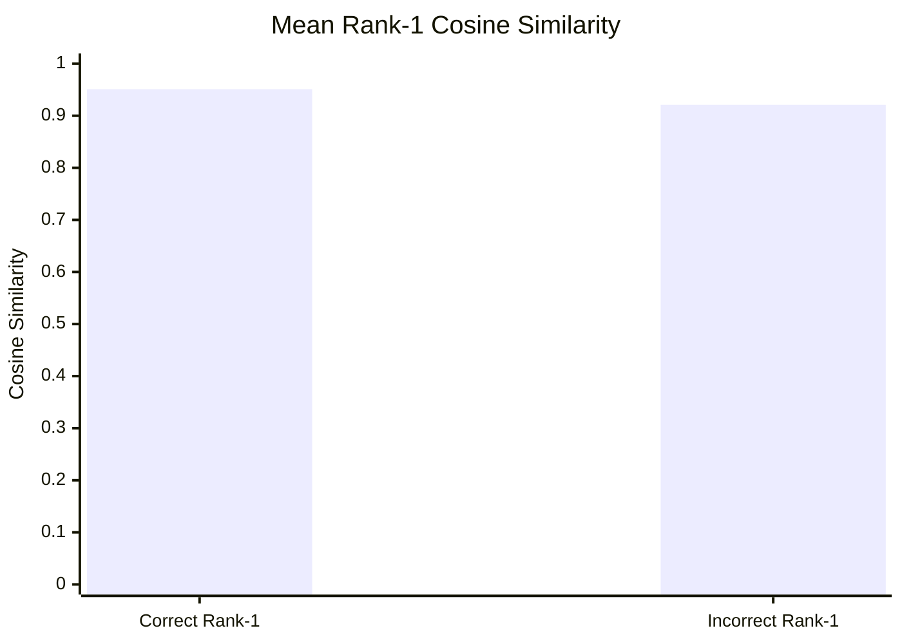
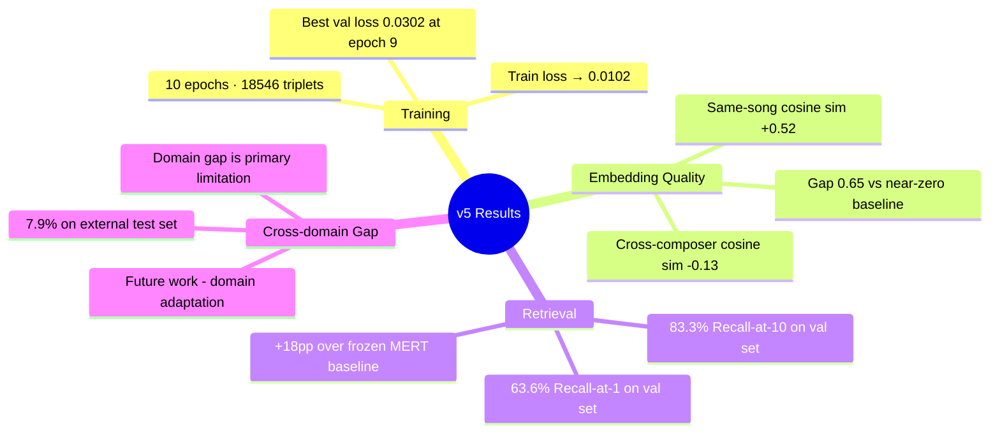

# Results & Evaluation

All numbers below come directly from `COLAB_MERT_Finetune_v5.ipynb` outputs.

---

## Evaluation Methodology

Retrieval quality is measured with **Recall@K**: given a 7-second query chunk, does the correct song appear in the top-K results from the FAISS index?

| Split | Chunks | Role |
|-------|--------|------|
| Gallery (index) | 34,930 | Vectors indexed in FAISS |
| Validation queries | 8,733 | Chunks used to measure Recall@K |
| External test set | 4,116 | Unseen recordings for cross-domain eval |

```
Recall@K = (queries where correct song is in top-K) / (total queries)
```

---

## Training Log — v5 (10 Epochs)

Epoch-by-epoch output from the notebook:

| Epoch | Train Loss | Val Loss | Pos Sim | Neg Sim | Gap | Best |
|-------|:----------:|:--------:|:-------:|:-------:|:---:|:----:|
| 1 | 0.0993 | 0.0950 | +0.563 | +0.078 | 0.485 | ✓ |
| 2 | 0.0560 | 0.0628 | +0.515 | −0.100 | 0.615 | ✓ |
| 3 | 0.0414 | 0.0525 | +0.512 | −0.144 | 0.656 | ✓ |
| 4 | 0.0316 | 0.0447 | +0.489 | −0.159 | 0.647 | ✓ |
| 5 | 0.0236 | 0.0399 | +0.523 | −0.114 | 0.637 | ✓ |
| 6 | 0.0191 | 0.0373 | +0.514 | −0.136 | 0.650 | ✓ |
| 7 | 0.0150 | 0.0317 | +0.519 | −0.170 | **0.689** | ✓ |
| 8 | 0.0125 | 0.0404 | +0.548 | −0.051 | 0.599 | |
| **9** | **0.0110** | **0.0302** | +0.520 | −0.130 | 0.650 | **✓ Best** |
| 10 | 0.0102 | 0.0320 | +0.521 | −0.128 | 0.649 | |

### Train vs Validation Loss



### Cosine Similarity Gap (Positive − Negative) per Epoch



---

## Validation Recall@K — Fine-tuned vs Baseline

```mermaid
xychart-beta
    title "Recall@K: Fine-tuned MERT + LoRA + CNN vs Baseline MERT"
    x-axis ["R@1", "R@3", "R@5", "R@10"]
    y-axis "Recall (%)" 0 --> 100
    bar [63.6, 73.6, 77.9, 83.3]
    bar [45.5, 55.6, 60.7, 67.9]
```



| K | Fine-tuned MERT + LoRA + CNN | Baseline MERT | Improvement |
|---|:---:|:---:|:---:|
| **1** | **63.6%** | 45.5% | **+18.2 pp** |
| **3** | **73.6%** | 55.6% | **+18.1 pp** |
| **5** | **77.9%** | 60.7% | **+17.2 pp** |
| **10** | **83.3%** | 67.9% | **+15.4 pp** |

---

## Cosine Similarity Distribution (Val Set)

The model produces well-separated embedding clusters after fine-tuning:



---

## External Test Set (Cross-Domain)

4,116 chunks from 38 **real audio recordings** queried against the synthesised MIDI gallery:



| K | Test Recall | Notes |
|---|:-----------:|-------|
| 1 | 7.9% | Cross-domain: real audio → synthesised MIDI |
| 3 | 14.1% | |
| 5 | 17.8% | |
| 10 | 25.1% | |

Lower numbers reflect the **domain gap** — the gallery is synthesised MIDI audio; queries are real recordings with different timbres, tempos, and variations. The model retrieves above chance throughout.

---

## Error Analysis

### Where is the correct song for missed Rank-1 queries?



### Mean Rank-1 Similarity: Correct vs Incorrect Predictions

The model is **calibrated** — scores for correct predictions are meaningfully higher:



---

## Model Comparison

| Model | Val R@1 | Val R@10 |
|-------|:-------:|:--------:|
| **MERT + LoRA + CNN (v5)** | **63.6%** | **83.3%** |
| Baseline MERT (frozen) | 45.5% | 67.9% |
| CNN + Mel Spectrogram | — | — |
| LSTM / GRU (MIDI tokens) | — | — |
| Siamese CNN | — | — |

---

## Key Takeaways


